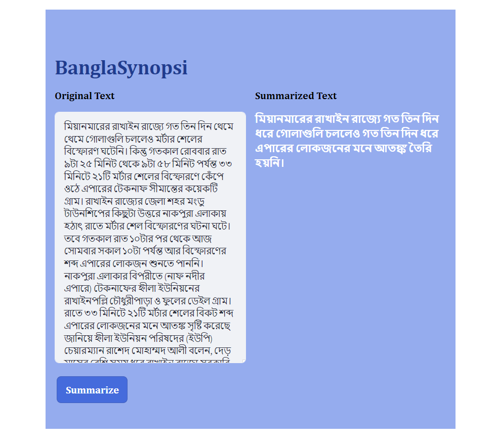

# Bangla Abstractive Newspaper Summarization App



This Streamlit web application allows users to summarize Bangla newspaper articles using abstractive summarization techniques. The app leverages Hugging Face's Transformers library for text summarization and provides a user-friendly interface for inputting Bangla text and viewing the summarized results.

## Features

- Summarize Bangla newspaper articles using advanced abstractive summarization techniques.
- User-friendly interface for inputting Bangla text and viewing the summarized results.
- Utilizes Hugging Face's Transformers library for state-of-the-art text summarization.
- Easy to deploy and use, suitable for both beginners and advanced users.

## Installation

To run the Bangla Abstractive Newspaper Summarization App locally, follow these steps:

1. Clone the repository:

```bash
git clone https://github.com/your_username/Bangla-News-Article-Summarization-App-using-Streamlit.git
cd Bangla-News-Article-Summarization-App-using-Streamlit

 pip install -r requirements.txt
 streamlit run app.py
